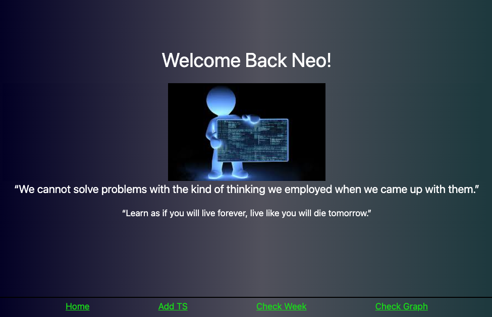
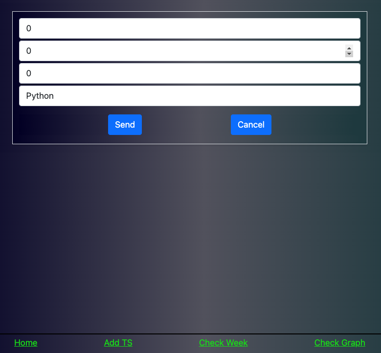
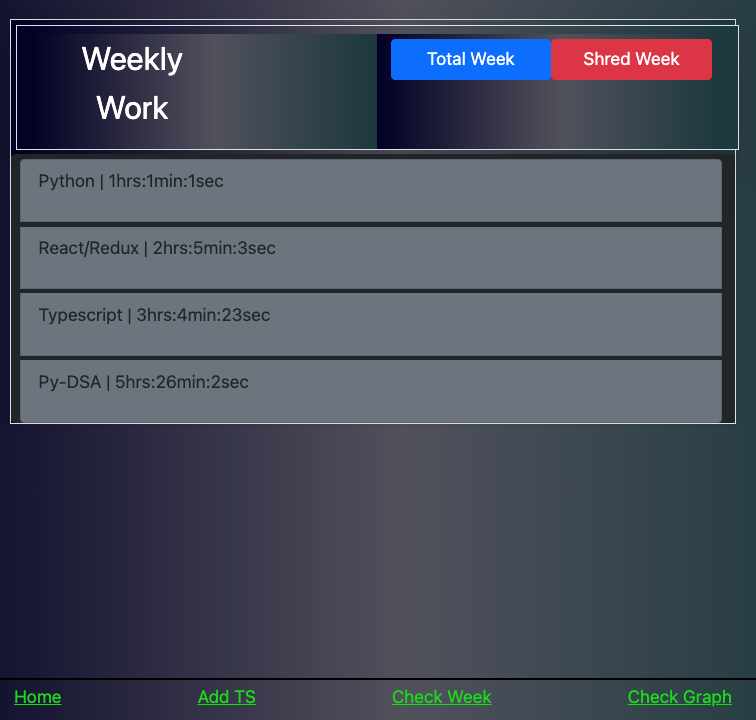
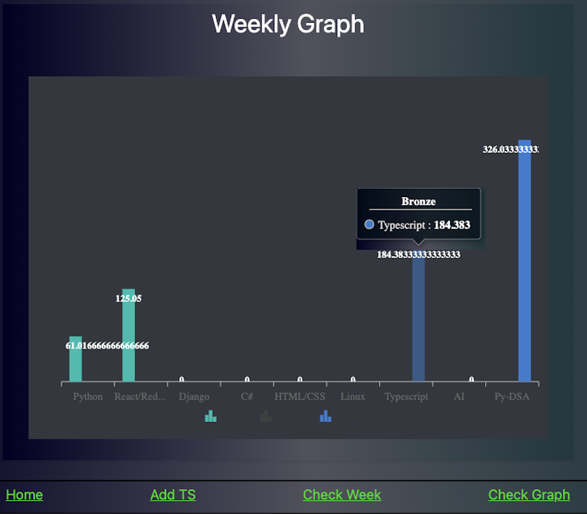
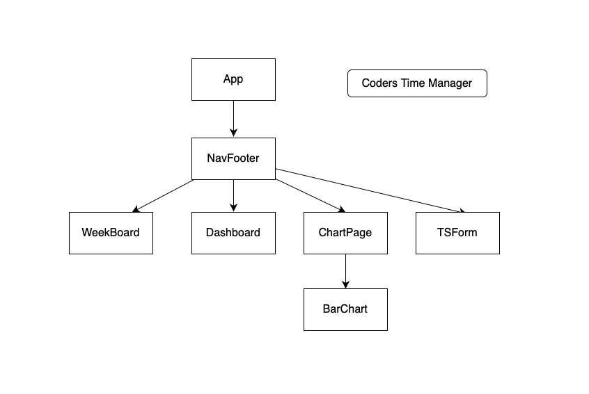

# Coders Time Manager:         
```s
- The opportunity to utilize your time to the fullest can be one that changes worlds. Efficiency and accuracy is important, so heres my visual aid.         
```
***       
## App Overview:          
      
      
      
      
      
***        
## Features:         
* Keeps Track of How much time is spent working and what subject your working on.      
* Ability to total the whole weeks overall time and shred the whole week making it extremely easy to use.       
* Also features a syncfusion bar chart to ba able to visualize how much time during the week you have been spending on each subject.      
* Alerts to make for an overall user friendly experience.        
***       
## Tech Used:        
- HTML5
- CSS
    * Bootstrap 5
    * Syncfusion
- JavaScript
    * React
    * Redux-Thunk
    * Axios
    * uuid
- Python
    * Django
    * Django REST
    * SQLite
    * Django-CORS-Headers

***       
### Author:         
[Github](https://www.github.com/neoj1sec142)        
[LinkedIN](https://www.linkedin.com/in/markharmon142)        
[Twitter](https://www.twitter.com/ManicNeo142)        
